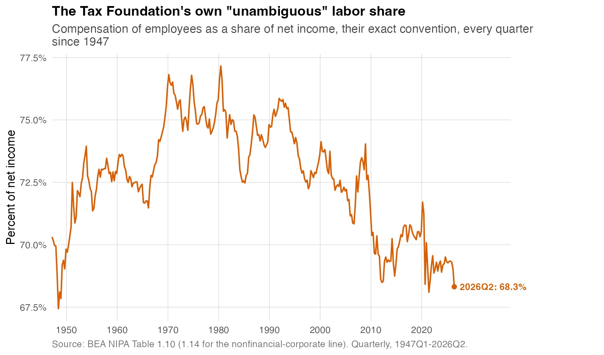
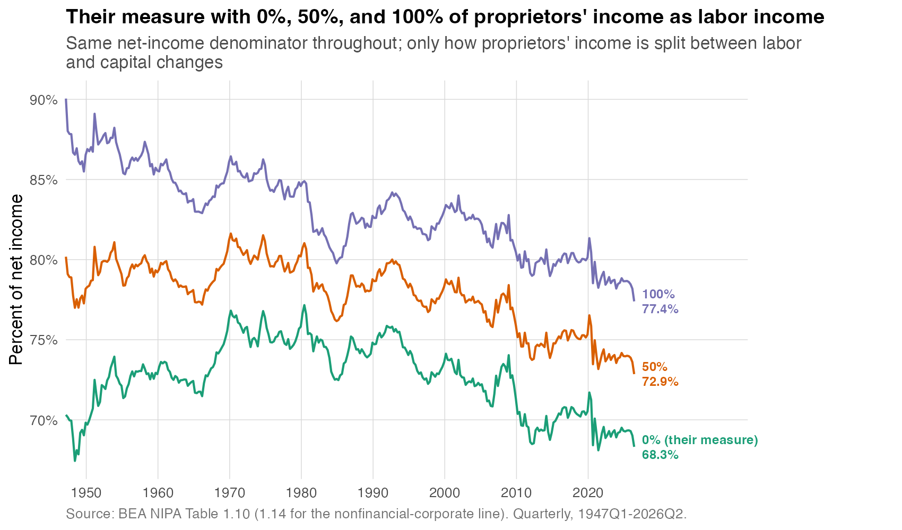
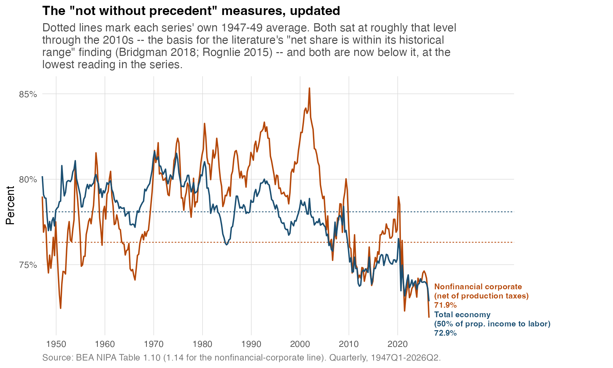
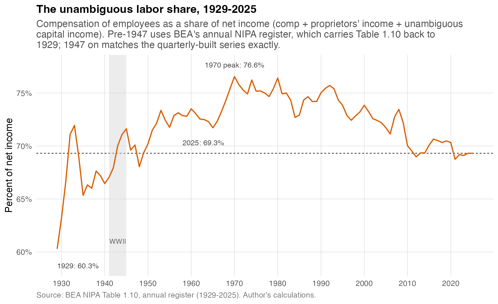
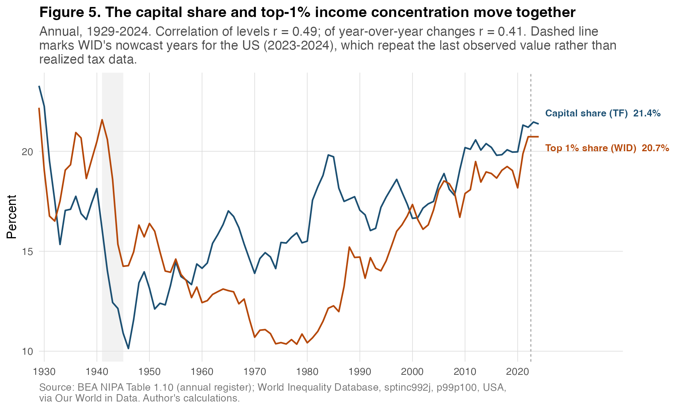

# I Disagree With The Tax Foundation, Labor Share Has Fallen

## Getting into the guts of NIPA and the longer capital share history.

There’s no one correct measure of the labor share. There are a lot of ways to consider what should go in the numerator and the denominator. But no matter how you approach it, I think three things are generally agreed upon for the United States:

1. After being in a steady range from the 1960s to 1990s, it has fallen notably since 2000.
2. It fell again during the pandemic and reopening, and after stabilizing, appears to be falling again since early 2025. While there are many explanations for the fall in the 2000s there are fewer ones for the more recent fall.
3. This is true if you include depreciation; depending on what you are measuring, gross measures tend to be lowest on record and net measures among the lowest on record, but even then the recent falls since 2025 may make them the lowest.

Throw whatever you want at it, this is generally true. This has gotten more attention lately, especially [with recent BLS gross measures](https://x.com/mtkonczal/status/2095490789086290430).

Richard DiSalvo and Erica York at the Tax Foundation have a [new post](https://taxfoundation.org/blog/capital-is-not-taking-half-of-americas-income-labor-share/) pushing back on this, arguing that we should understand the labor share as making a “round trip” over the postwar era rather than falling. Their conclusion:

> The labor share is back to a historically precedented, not “never-before seen,” level. And the “downward trend throughout” needs to be replaced with “the labor share rose, then fell, over the postwar era.” It has made a round trip, rather than declining consistently from its starting level.

So nothing to especially worry about, just a “round trip” back to older, historically precedented values.

Where to start? I think five things.

**First**, their data concedes my first two points above. Here’s their “unambiguous labor share” in Figure 1:

After being stable in the 1950s through 1990s, it fell, and fell again over the past six years. So we’re in agreement there. Should we call it a day? Well we’re already here. The open question is number 3 above, what to make of the idea about this “round trip.” So let’s keep going.

**Second**, if you include proprietary income as labor income for their measure, then it becomes the lowest on record. Let’s stick with their measure, and add in some proprietary income as labor income. Their post is in a bind, because it wants to argue, following the latest evidence, that we should think of prop income as being mostly labor income, on the order of three-quarters ([Smith et al 2019](https://www.nber.org/papers/w25442)), to try and talk up the idea that there’s a lot of mismeasured and hidden labor income out there. Fair enough. But if you do that, given the higher share of prop income in the 1940s, it raises the labor share then. Here is their measure with 0%, 50%, and 100% of prop income as labor income:

Adding any prop income to labor share raises the level of income today but it also raises it even more in the 1940s, since prop income was a much bigger share of the economy then. At 50% or at 100% to labor, the current quarter isn’t just low, it’s the single lowest reading in the entire 1947-2026 series.

**Third**, As you can see from Figure 1, their idea of a "round trip" is really dependent on a handful of data points in the late 1940s when the quarterly data starts. But that’s a brief window. Sticking with their unambiguous labor share measure, the average in the 21st century (2000Q1-2026Q2) is 70.8%, which is below the 73.9% average from 1950-1999. While the average is 69.2% in 1947-1949, by 1950 to 1952 it’s 71.3% and it increases fast from there.

Their round trip language invokes a staple of the labor share literature debates of the 2010s, which is that net share is back to earlier historical ranges. As [Grossman and Oberfield (2022)](https://www.nber.org/papers/w29165) put it: "The gross labor share was relatively stable through 2000, but then declined to a level below its historical range. In contrast, as noted by Bridgman (2018) and Rognlie (2015), the net labor share had been rising between 1940 and 1980, so the recently lower level is not without precedent."

That was definitely true in 2015 and 2018. But is that true now? I want to use a labor share more consistent with the literature than what the Tax Foundation does.[Footnote: A funny thing about their definition is that the non-profit sector, because it TKTKTKAITK, I believe treats it as having a 100% labor share. Truly, us non-profit workers are the vanguard of the working class!] Here are the two measures I watch most closely: the net labor share of the nonfinancial corporate sector AI FIX THIS IN THE DATA TKTKTK (so there’s no prop income to worry about), and the whole economy’s AIISTHISCORPORATE? net income with 50% of proprietors’ income counted as labor:

As you can see here, during the 2010s, this hung out in roughly the 1940s level. So a round trip? But since COVID this has collapsed further, and fallen even more since Trump took office at the beginning of 2025. Something is different.

**Fourth**, they imply that the labor share was stable at a “starting level” before this higher midcentury range. Since they use quarterly data they can only go to 1948 in the NIPAs. But the real heads know if you really dig deep into those NIPA flatfiles, which you can conveniently do with [tidyusmacro::getNIPAFiles()](https://github.com/mtkonczal/tidyusmacro/blob/main/R/getNIPAFiles.R) function from my R library, you can get annual data from 1929 onward.

As you’ll see below, it’s very unstable during this period. Here’s their measure dating back to 1929:

It itself is making many round trips! The topsy-turvy nature of this is why Robert Solow argued, using this data from 1929 to 1954, that he was “skeptical” about any consistency in the labor share that many assumed ([Solow 1958](https://www.jstor.org/stable/1808271)). So I’m not convinced that there’s a “starting level” at all.

Fifth, building on that, labor share actually mirrors 1% inequality this way. Using the annual data again, take the capital share of net income and put it up against Piketty and Saez’s top 1% share (from the [World Inequality Database](https://wid.world/country/usa/) through 2024), and take a look (Figure TK):

It’s the same story? Different decades along the way, but it certainly comes back over the full 1929-2024 overlap. I think we have a story that 1% inequality has largely been a choice we’ve made, though obviously many people argue it’s strictly a matter of supply and demand. We certainly don’t, in the back of our heads, think that the 1% share is fixed deep in the economy. Perhaps it’s time we think the same thing with the capital share.