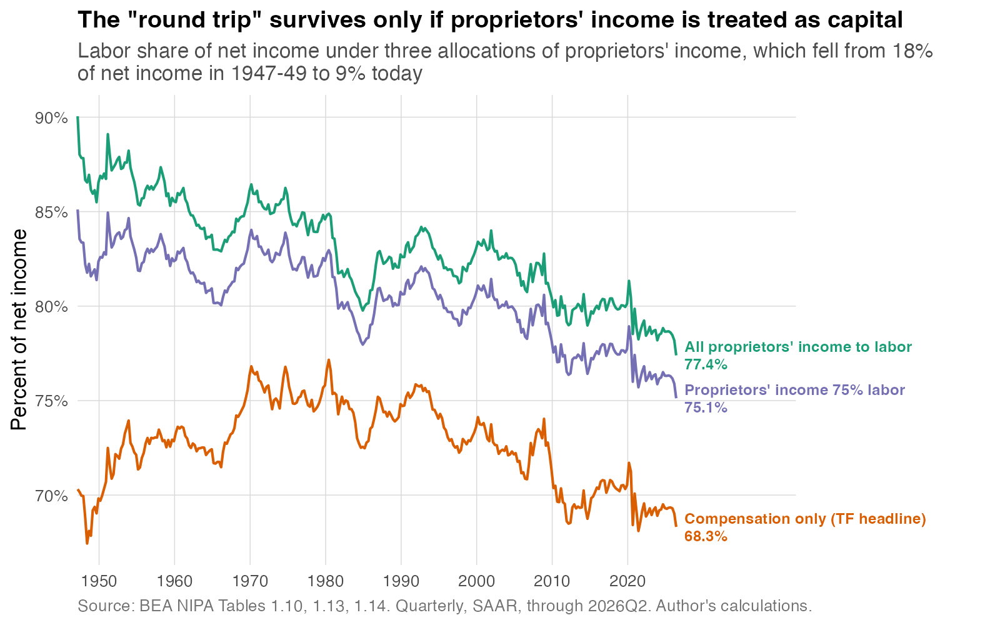

# I Disagree With The Tax Foundation, Labor Share is Falling
## Getting into the guts of NIPA and checking capital share against the 1%.

There’s no one correct measure of the labor share. There are a lot of ways to consider what should go in the numerator and the denominator. But I think four things are generally agree upon in the United States:

1. After being in a steady range from the 1950s to 1990s, it has fallen notably since 2000.
2. It fell again during the pandemic, and after stabilizing, appears to be falling again since early 2025.
3. This is true if you include depreciation; with gross measures it tends to be the lowest on record but with net measures the late 1940s were in a similar range, so not lowest “on record."

Throw whatever you want at it, this is generally true. This has gotten more attention lately, especially with the recent fall over the past year and a half. Richard DiSalvo and Erica York at Tax Foundation has a [new post](https://taxfoundation.org/blog/capital-is-not-taking-half-of-americas-income-labor-share/) pushing back on this, arguing that we should understand the labor share as making a "round trip" over the postwar era rather than falling. Their conclusion:

THEM:
--
The labor share is back to a historically precedented, not “never-before seen,” level. And the “downward trend throughout” needs to be replaced with “the labor share rose, then fell, over the postwar era.” It has made a round trip, rather than declining consistently from its starting level.
--

I don’t personally use how they’ve set up their numerators and denominators and the literature generally doesn’t either. But it doesn’t matter. Their data concedes the three points above, here’s their “unambiguous labor share” as well as three-quarters ([Smith et al 2019](https://www.nber.org/papers/w25442)) and all of proprietors’ income treated as labor income instead (Figure 1):

So we’re in agreement there. The question is what to make of the idea about this "round trip.”

First, they are relying a lot on a few years in the late 1940s here. But the drop is noticeable even for that. Sticking with their unambiguous labor share measure, the average in the 21st century (2000-2025) is 70.8 percent, which is below the 73.9 percent average from 1950 to 2000. It’s not a narrow peak, it’s a long stretch going back to nearly the beginning of the data. Comparing that six-quarter stretch to every other continuously-running six-quarter stretch since 1948 — 303 of them, using their own quarterly series — it's lower than 292 of them, and higher than only 11, three of which cluster around the late-1940s reconversion, three around the 2011-13 profit-margin peak, and four around the 2020-22 pandemic period.

Second, they imply that the labor share was stable at a “starting level” before this higher midcentury range. Since they use quarterly data they can only go to 1948 in the NIPAs. But the real heads know if you really dig deep into those NIPA flatfiles, which you can conveniently do with R’s [tidyusmacro::getNIPAFiles()](https://github.com/mtkonczal/tidyusmacro/blob/main/R/getNIPAFiles.R) function from my library, you can get annual data from 1929 onward.

As you’ll see below, it’s very unstable during this period. Here’s their measure — compensation as a share of net income, their exact convention — dating back to 1929, in Figure 2:

It itself is making many round trips! The topsy-turvy nature of this is why Robert Solow argued, using the data from 1929 to 1954, that he was “skeptical” about any consistent here ([Solow 1958](https://www.jstor.org/stable/1808271)). So I’m not convinced that there’s a “starting level” that the Tax Foundation assumes.

Third, labor share actually kind of mirrors 1% inequality this way. Using the annual data again, take the capital share of net income — the same unambiguous-capital measure used throughout — and put it up against Piketty and Saez's top 1% share, now maintained by the [World Inequality Database](https://wid.world/country/usa/), and take a look (Figure 3):

It’s the same story? Different decades along the way, but it certainly comes back — the two series correlate at r = 0.49 in levels and r = 0.41 in year-over-year changes over the full 1929-2024 overlap. I think we have a story that 1% inequality has largely been a choice we've made, though obviously many people argue it's strictly supply and demand. We certainly don't, in the back of our heads, think that the 1% share is fixed deep in the economy, or, to the extent anyone ever thought that, they've unlearned that in the last several generations. Perhaps it's time we unlearn the same thing with the capital share.